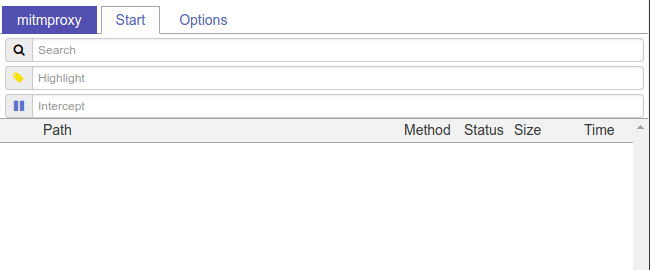
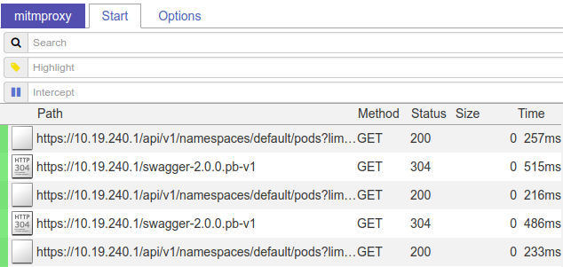

# kube-apisnoop

Transparent proxy that observes the Kubernetes API server requests of pods and addons.

Based on kubernetes-tproxy - https://github.com/danisla/kubernetes-tproxy

**N.B. This is currently being worked on and is subject to change**

## Requirements

- **Kubernetes** - with **Initializers enabled (alpha feature)** (Tested on GKE v1.9.3-gke.0) 
    - Self-hosted - https://kubernetes.io/docs/admin/extensible-admission-controllers/#enable-initializers-alpha-feature
    - On GKE - https://cloud.google.com/kubernetes-engine/docs/concepts/alpha-clusters - For example:

```bash
gcloud container clusters create tproxy-example \
  --zone us-central1-f \
  --machine-type n1-standard-1 \
  --num-nodes 3 \
  --enable-kubernetes-alpha \
  --cluster-version 1.9.3
```

- **Helm**

```bash
curl -L https://raw.githubusercontent.com/kubernetes/helm/master/scripts/get | bash
helm init
```

- **Kubectl**

```bash
curl -LO https://storage.googleapis.com/kubernetes-release/release/v1.9.6/bin/linux/amd64/kubectl
chmod +x kubectl
sudo mv ./kubectl /usr/local/bin/
```

- **Docker** - see https://docs.docker.com/install/
- **OpenSSL**

```bash
sudo apt-get update && sudo apt-get install openssl
```


## Setup proxy pods and initializer

### 1. Clone repo and checkout branch

```bash
git clone -b kubesnoop https://gitlab.ii.coop/cncf/kubernetes-tproxy.git
cd kubernetes-tproxy
```

### 2. Create a certificate request for mitmproxy and send it to Kubernetes to be signed

```bash
./create_kubeapi_crt.sh
```

**Output:**

```
Generating key
Generating RSA private key, 2048 bit long modulus
[...]
Generating k8s-ca.pem
Generating csr request
Adding CSR to Kubernetes
certificatesigningrequest "k8s-mitm-20180323.222453.ii" created
Approving CSR
certificatesigningrequest "k8s-mitm-20180323.222453.ii" approved
Getting result cert
Done. Heres the result
[...]
```

### 3. Install the proxy pods and initializer using helm
```
./setup-mitm-proxy.sh
```

**Output:**

```
Installing tproxy using helm....
NAME:   tproxy
LAST DEPLOYED: [...]
NAMESPACE: default
STATUS: DEPLOYED

RESOURCES:
==> v1/ConfigMap
NAME                       DATA  AGE
tproxy-tproxy              2     4s
tproxy-tproxy-initializer  1     4s
tproxy-tproxy-root-certs   1     4s
[...]
```

## Example deployment

Deploy examples/kubectl-app.yaml to test things out. This deployment repeatedly calls `kubectl get pods` every 5 seconds.

```bash
kubectl apply -f examples/kubectl-app.yaml
```

Find out which node the deployed pod is running on:

```bash
./list_pod_nodes.sh
```

**Example output:**

```
POD                          NODE
kubectl-app-c7556b7f4-lj8px  gke-loomio-ii-nz-default-pool-b70b968b-xj55
tproxy-tproxy-cbgsb          gke-loomio-ii-nz-default-pool-b70b968b-xj55
tproxy-tproxy-scmxq          gke-loomio-ii-nz-default-pool-b70b968b-q5t7
```

Work out which tproxy pod is on the same node as the pod you just deployed. 
In this case, the pod **kubectl-app-c7556b7f4-lj8px** is on the same node as the tproxy pod **tproxy-tproxy-cbgsb**. Your pod names will be different.

Port forward the web interface on the chosen tproxy pod - (in this case it is **tproxy-tproxy-cbgsb**)

```bash
kubectl port-forward tproxy-tproxy-cbgsb 9000:8081
```

Go to the website http://127.0.0.1:9000 for the mitmproxy web interface.

</img>

Notice how there are no logging events showing in mitmweb. You can get the logs of the example pod by:

```
kubectl logs kubectl-app-c7556b7f4-lj8px --tail=20
```

Now activate logging by annotating the pod:

```
kubectl annotate pod kubectl-app-c7556b7f4-lj8px  initializer.kubernetes.io/tproxy=true --overwrite
```

You will now see the kubectl api requests logged in mitmweb.

</img>

## Tag your own deployments

To observe the API server traffic for a pod, add the following to its spec:

```yaml
metadata:
  annotations:
    "initializer.kubernetes.io/tproxy": "true"
```

Or alternatively, use the following command to annotate an already deployed pod:

```bash
kubectl annotate pod your-pod initializer.kubernetes.io/tproxy=true
```
